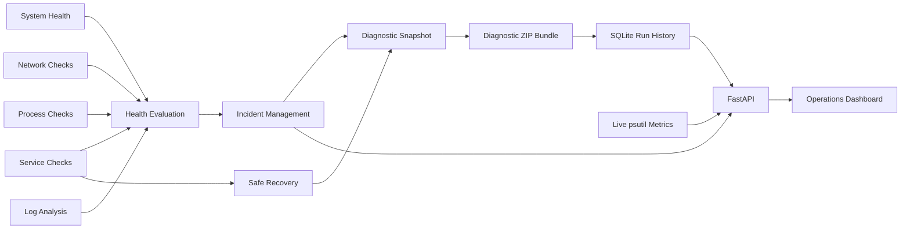

# LabOps AI

LabOps AI is a Linux infrastructure monitoring, diagnostics, incident management, and operations dashboard project built with Python, FastAPI, Bash, systemd, SQLite, and vanilla JavaScript.

The current version is a working end-to-end monitoring platform: it collects system and application signals, evaluates health, manages incidents, performs controlled recovery actions, creates diagnostic ZIP bundles, stores run history, exposes a REST API, and presents the results in a real-time web dashboard.

> **Project status:** Working MVP under active development. The current implementation focuses on deterministic monitoring and automation. AI-assisted diagnosis and incident correlation are planned future capabilities.

## Current Capabilities

### Infrastructure monitoring

- CPU, memory, and disk utilization monitoring
- Linux load averages, uptime, process count, and CPU count
- DNS and TCP connectivity checks
- Linux service monitoring through `systemctl`
- Process discovery and resource monitoring through `psutil`
- Configurable file-based log analysis
- Health classification using `HEALTHY`, `WARNING`, and `CRITICAL`

### Incident and recovery workflow

- Incident creation from system, network, service, process, and log signals
- Incident lifecycle tracking and occurrence counting
- Active, acknowledged, and resolved incident views
- JSON-backed incident persistence
- Policy-controlled recovery actions for configured services
- Recovery state tracking to prevent uncontrolled repeated actions

### Diagnostics and history

- Complete diagnostic snapshots for every monitoring run
- ZIP bundles containing technical evidence and a manifest
- SQLite-backed run history
- Configurable history retention
- Historical run details loaded from the original diagnostic ZIP
- CSV export for filtered run history
- Scheduled monitoring through a user-level systemd timer

### API and dashboard

- FastAPI REST API with Swagger and ReDoc documentation
- Production-style Uvicorn configuration loaded from JSON
- User-level systemd service for the API and dashboard
- Real-time metrics streamed with Server-Sent Events
- Live CPU, memory, disk, network throughput, load, uptime, and process data
- Professional operations dashboard with health analytics and trends
- Incident Center with filtering, sorting, summaries, and detail views
- Run Intelligence view for historical ZIP diagnostics
- Interactive chart tooltips with precise values and timestamps
- Host filtering and server-side host suggestions
- Automatic dashboard refresh and connection-state reporting

## How the Monitoring Pipeline Works



A normal monitoring execution runs the components in sequence, creates or updates incidents, evaluates configured recovery actions, builds a diagnostic archive, and saves a searchable history record.

## Technology Stack

- Python 3.12+
- FastAPI and Uvicorn
- `psutil`
- SQLite
- Bash
- Linux `systemd`
- HTML, CSS, and vanilla JavaScript
- Server-Sent Events
- pytest

## Quick Start

### Requirements

- Linux or WSL2
- Python 3.12 or newer
- `systemd` for service monitoring and managed background execution
- Git

### Install

```bash
git clone https://github.com/Ronenk7/labops-ai.git
cd labops-ai

python3.12 -m venv .venv
source .venv/bin/activate
python -m pip install --upgrade pip
python -m pip install -e ".[dev]"
```

### Run the complete monitoring pipeline

```bash
python -m labops_ai
```

This runs system, network, service, process, and log monitoring, evaluates incidents and recovery actions, generates a diagnostic ZIP, and stores the run in SQLite.

### Start the API and dashboard manually

```bash
python -m labops_ai.api.server
```

Open:

- Dashboard: `http://127.0.0.1:8000/dashboard`
- Swagger API documentation: `http://127.0.0.1:8000/docs`
- ReDoc documentation: `http://127.0.0.1:8000/redoc`

The default host and port are defined in `config/api_server.json`.

### Run the API as a user systemd service

```bash
./scripts/manage_api_systemd_user.sh install
```

Service management commands:

```bash
./scripts/manage_api_systemd_user.sh status
./scripts/manage_api_systemd_user.sh restart
./scripts/manage_api_systemd_user.sh logs
./scripts/manage_api_systemd_user.sh uninstall
```

The service runs from the project virtual environment and performs an API health check after installation or restart.

## Main API Endpoints

| Endpoint | Purpose |
|---|---|
| `GET /api/v1/health` | API process health |
| `GET /api/v1/live/snapshot` | One immediate live system sample |
| `GET /api/v1/live/stream` | Continuous live metrics through SSE |
| `GET /api/v1/dashboard/overview` | Aggregated health and reliability analytics |
| `GET /api/v1/incidents/summary` | Incident lifecycle statistics |
| `GET /api/v1/incidents` | Filtered incident list |
| `GET /api/v1/incidents/{incident_id}` | One incident by ID |
| `GET /api/v1/runs/latest` | Latest stored monitoring run |
| `GET /api/v1/runs` | Filtered run history |
| `GET /api/v1/runs/{run_id}` | One stored run |
| `GET /api/v1/runs/{run_id}/details` | Diagnostic data read from the run ZIP |
| `GET /api/v1/runs/export.csv` | Download run history as CSV |
| `GET /api/v1/hosts/suggestions` | Host-name suggestions for dashboard filters |

## Live Metrics Notes

The dashboard updates live metrics approximately every two seconds.

Network throughput is calculated from the difference between Linux network byte counters across samples. It is passive observation, not an active speed test, and currently represents aggregate traffic visible to the Linux or WSL environment.

Historical Run Intelligence data and live telemetry are intentionally separated:

- **Historical data** is an immutable snapshot loaded from the diagnostic ZIP.
- **Live data** represents the host at the current moment.

## Configuration

Runtime behavior is controlled by validated JSON files in `config/`:

- `system_health.json`
- `network_connectivity.json`
- `service_monitor.json`
- `process_monitor.json`
- `log_analyzer.json`
- `incident_management.json`
- `incident_signals.json`
- `diagnostic_bundle.json`
- `run_history.json`
- `recovery_actions.json`
- `api_server.json`

Configuration is kept outside the Python implementation so thresholds, targets, monitored services, processes, log sources, retention, recovery policy, and server behavior can be changed without modifying application code.

## Testing

Run the complete automated test suite:

```bash
python -m pytest -q
```

The project includes unit and integration coverage for monitoring components, configuration validation, incidents, recovery, diagnostic bundles, history storage, API routes, dashboard assets, ZIP-backed run details, and live metrics.

## Project Structure

```text
labops-ai/
├── config/                 External JSON configuration
├── scripts/                systemd and operational helper scripts
├── src/labops_ai/
│   ├── api/                FastAPI, live routes, dashboard, and reporting
│   ├── config/             Shared configuration loading
│   ├── diagnostics/        Snapshot and ZIP bundle pipeline
│   ├── history/            SQLite run history and retention
│   ├── incidents/          Incident lifecycle and persistence
│   ├── logs/               Log analysis
│   ├── network/            DNS and TCP connectivity checks
│   ├── processes/          Process monitoring
│   ├── recovery/           Controlled recovery actions
│   ├── services/           systemd service monitoring
│   └── system_health/      CPU, memory, and disk monitoring
├── tests/                  Unit and integration tests
└── pyproject.toml          Package metadata and dependencies
```

## Safety and Scope

- Recovery actions are limited to explicitly configured services and policies.
- The dashboard is bound to `127.0.0.1` by default and is not exposed externally.
- The project is designed for Linux and WSL environments.
- Live network values describe observed throughput and must not be interpreted as internet bandwidth capacity.
- GPU monitoring is not yet implemented in the current version.

## Next Development Areas

- Multi-host collection and centralized monitoring
- Per-interface and per-process network visibility
- Authentication and role-based dashboard access
- Notifications and alert delivery
- Longer-term metric storage and historical performance charts
- AI-assisted incident correlation, root-cause suggestions, and troubleshooting guidance
- Packaging and deployment improvements

## Author

Developed by [Ronen Kukner](https://github.com/Ronenk7) as a practical Linux infrastructure, operations, and application-support portfolio project.
